# IntoYun App 使用手册
版本v0.1.0

本文档说明适用于IntoYun App的android版本和iOS版本

## 功能概述

IntoYun App [iPhone](https://itunes.apple.com/us/app/intoyun-build-photon-electron/id991459054?ls=1&mt=8) | [Android](https://www.intoyun.com/dwonloads/apps/IntoYun.apk) 配合IntoYun开放平台为用户提供方便的设备控制，开发调试，关联控制，参考App等功能。使用用户更容易开发，缩短产品开发周期，加快产品市场化进程。

#### App主要功能
- **[登录注册](#login)**
- **[设备展示](#device)**
- **[关联控制](#recipe)**
- **[通知消息](#message)**

## 登录注册流程
### 注册账号

为方便手机用户，IntoYun App只提供手机号码注册。通过发送手机短信验证码，用户可以很方便的注册成为IntoYun平台的开发者。

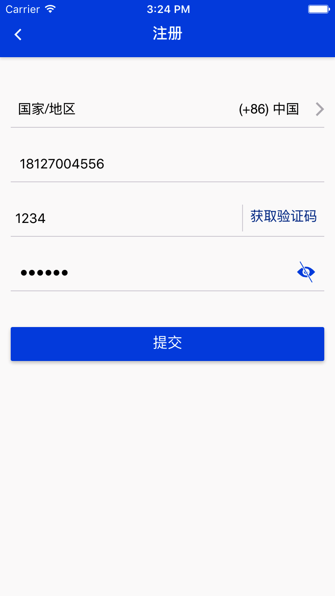

**提示：**

- 注册账号必须为手机号码（仅限手机App端，Web端可使用邮箱/手机）
- 注册密码需为字母、数字和下划线"_"2种及以上组合，且限制6-20个字符

### 登录

登录可以允许**手机号码**或**电子邮箱**账号登录。

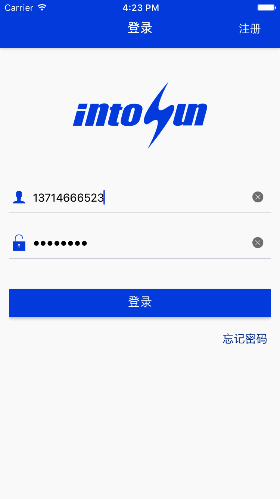

### 找回密码

当用户忘记密码了，可以通过点击登录界面的**忘记密码**跳转到找回密码界面，进行重新设置密码。

### 修改密码

用户登录后也可以修改密码

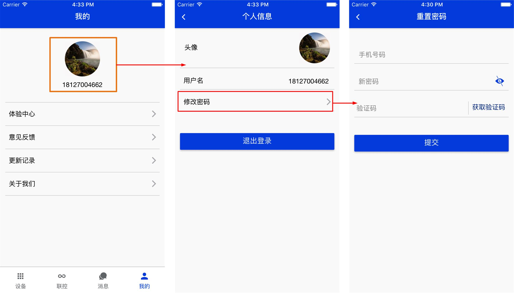

### 修改用户头像

在个人信息界面点击***头像***，可以编辑上传头像，可选择相册或相机。

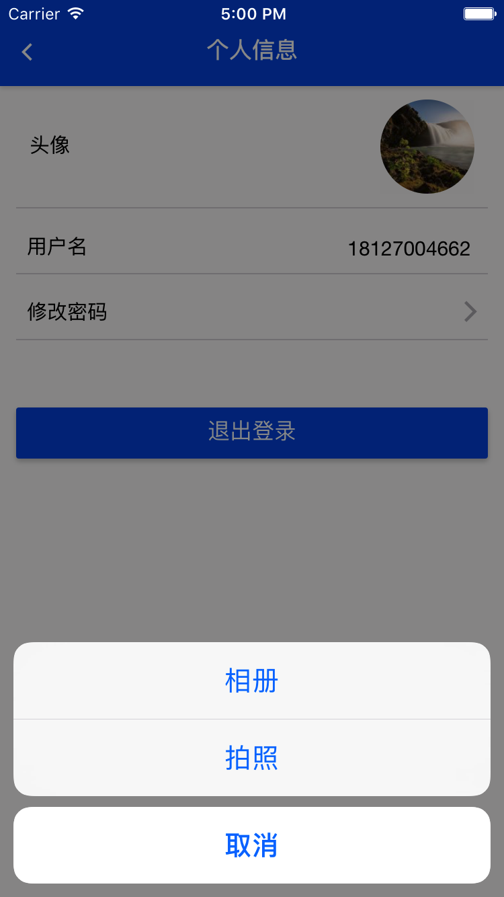

## 设备展示与控制

主要内容包括：

- 体验中心
- 设备展示
- 设备控制
- 配置设备
- 添加设备（扫描二维码）

### 体验中心

初次登录App时，当用户没有绑定设备时，设备列表界面为空, 可点击***进入体验中心***查看演示设备，智能灯或智能农业。

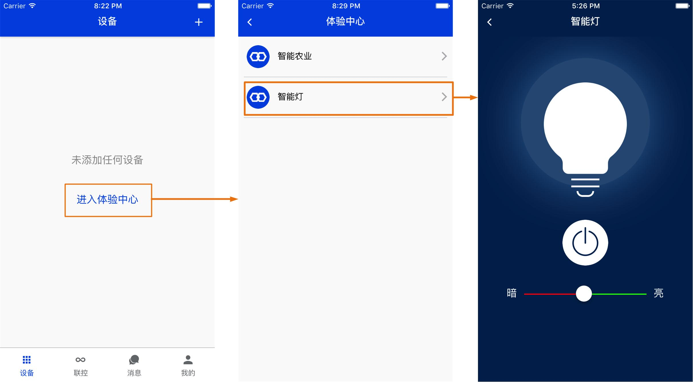

### 添加设备
添加设备是指将IntoRobot硬件设备（包括Atom，Neutron，Nut等）通过ImLink配置或扫描二维码的方式添加到用户设备列表中，以供用户查看设备信息和在线状态。

#### 通过ImLink配置添加（**仅限WiFi设备**）

当设备没有连接网络（闪蓝灯）时，长按设备的侧边按钮3秒，设备慢闪红灯时，进入配置模式。打开App进入配置界面，如下图，点击开始进行ImLink配置，等待配置成功，自动跳转到设备列表界面，此时设备列表将多出一个新配置成功的设备。

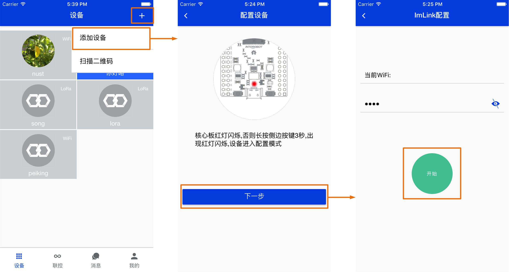

**注意事项**

- 配置时需要手机打开WiFi，连接到环境中的路由器，并且能上网
- 输入正确的路由器密码
- 如果第一次配置不成功，先将设备复位后再重新配置。

#### 通过二维码扫描添加（可用于包括WiFi，GPRS，LoRa）

GPRS设备和LoRa设备出厂即可上网，此时通过扫描二维码将设备添加到用户设备列表中，二维码是随设备出厂时生成的。扫描成功后，自动跳转到设备列表界面，此时设备列表将多出一个新配置成功的设备。

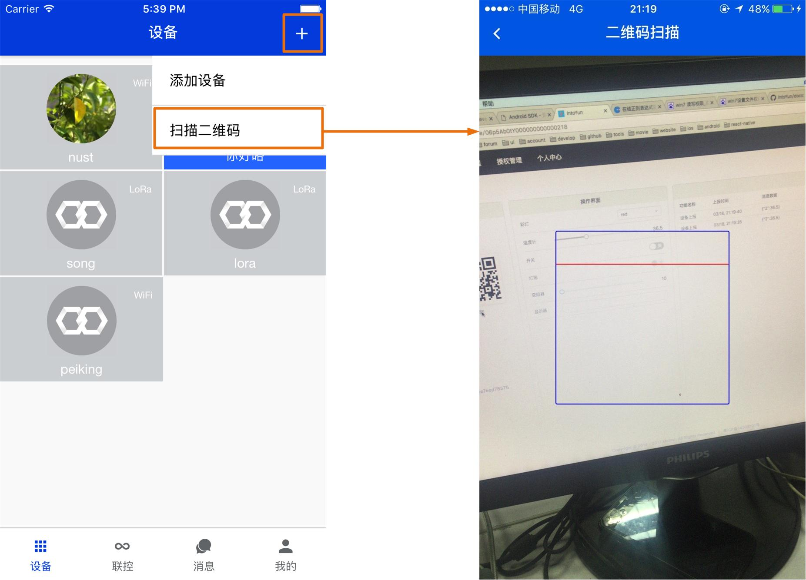

#### 通过二维码扫描添加模拟设备
在开发设备数据点阶段可用模拟设备进行调试，测试数据点设计的通路是否正常，加速开发。用户在[平台端](https://www.intoyun.com/product)创建一个产品后，该产品默认会自动生成一个模拟设备用于数据点调试开发。可通过手机App扫描二维码的方式添加到设备列表中。模拟设备在***产品管理***下的***模拟设备***里，扫描二维码如下图所示的位置。

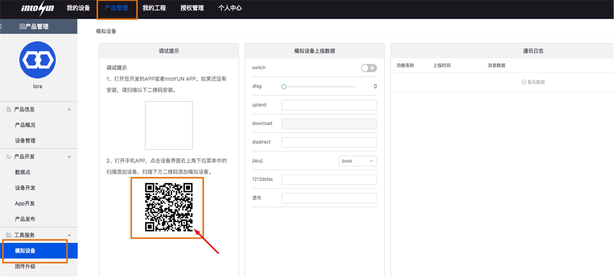

### 设备控制
设备列表列出用户的所有设备，其中在线的显示背景为蓝色，离线设备背景显示为灰色。在线设备才可以有效的控制，收发数据。
点击设备跳转到设备控制界面，设备控制界面显示该设备所属产品的数据点（***不包括透传型数据***）。设备列表中每个设备右上角显示为设备类型，如WiFi，RoLa，GPRS分别代表连接网络方式为WiFi，RoLa和GPRS的设备。

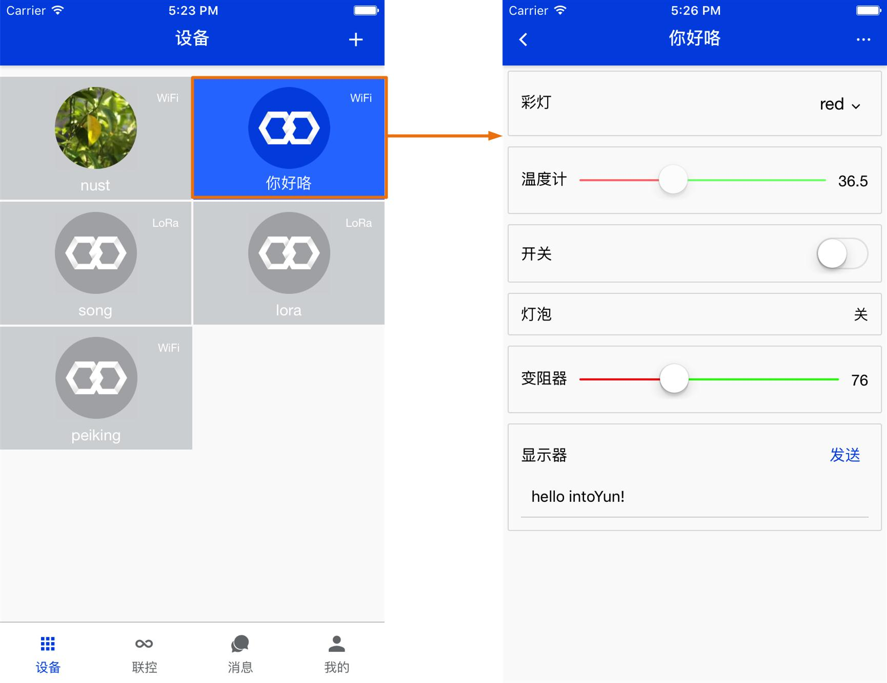

### 设备信息修改
设备头像和名称可由用户自行上传修改。

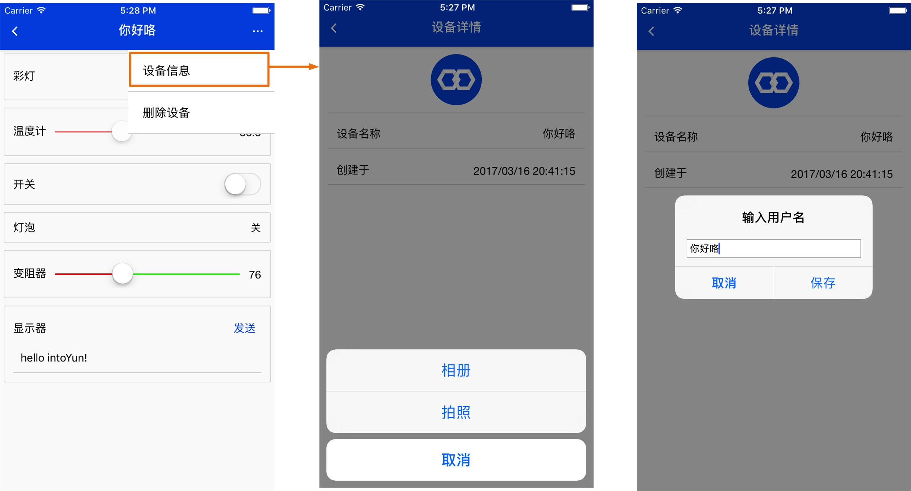

## 关联控制

### 关联控制概述
关联控制是指通过设置设备之间的关联，实现以物控物。简单便捷的图形化关联控制功能。通过最为简洁的图标选择的方式，无需编程或复杂的操作，就可以建立各种条件和动作的关联。这个功能非常简单，有趣而且充满了无限可能：例如可以只通过点击操作，设置花盆缺水的时候自动浇水，有人闯入家里的时候自动报警，温度过高的时候自动邮件通知等。

### 创建关联控制

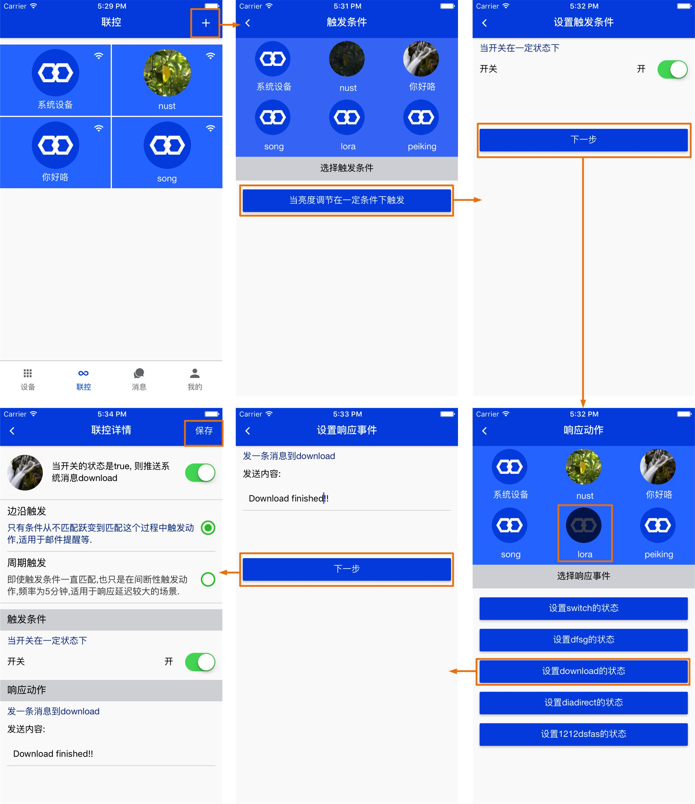

初次登录App时，里面没有任何关联控制时，可点击右上角的“+”开始创建关联控制。

创建流程：

* **选择触发条件**，如上图选择触发条件为***nust***设备的***亮度调节***数据点

* **设置触发条件**，如上图设置了***nust***设备的***亮度调节***数据点的***开关状态***为***开***

* **选择响应动作**，如上图选择响应动作为***lora***设备的***download***数据点

* **设置响应事件**，如上图设置了发送消息“dwonload finished!”到***lora***设备的***download***数据点

最后显示设置关联控制的一个详细信息预览。
该关联控制将会监听***nust***设备的***亮度调节***数据点的开关状态，当***亮度调节***数据点为打开状态时，则服务器会向***lora***设备的***download***数据点发送一条消息“dwonload finished!”。此场景可用于在LCD显示屏上显示一些关联信息。除了用户设置自己的设备之间的关联控制，IntoYun平台还提供了定时功能，发送邮件和发送通知消息功能，用户可以根据系统时间，定时让某个设备执行开关或某种动作。

### 关联控制分类
关联控制列表是按照触发条件进行归类的。

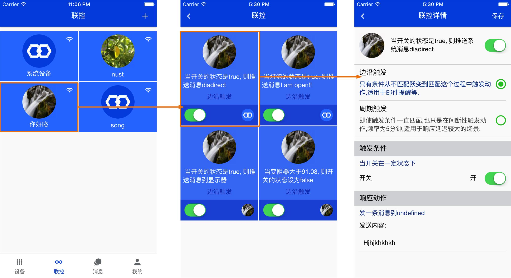

## 通知消息

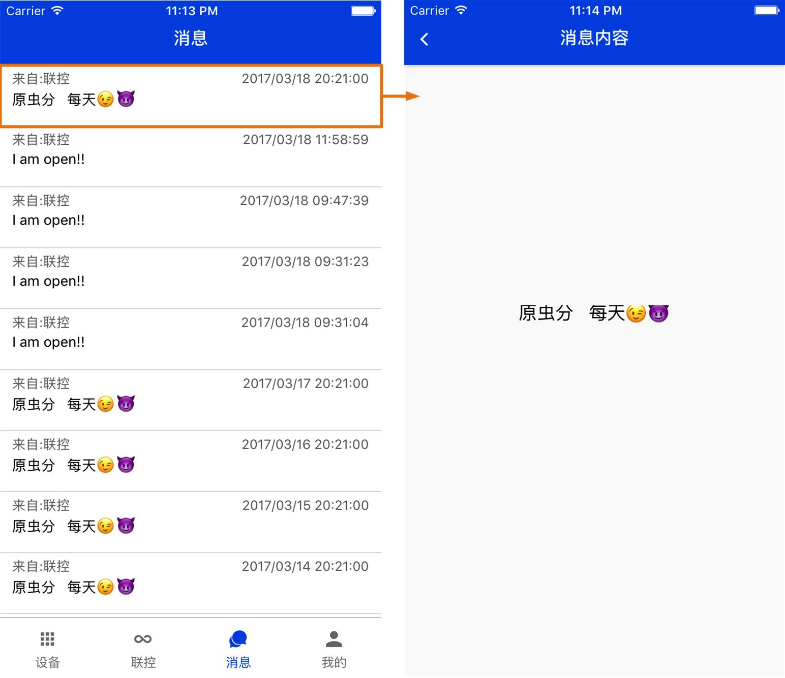

